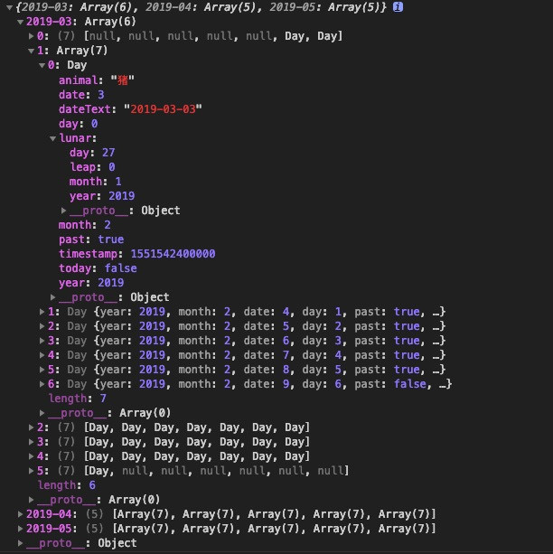

# Kalendar

### Date table data generation

[中文](./README-zhCN.md)

[](https://www.npmjs.com/package/kalendar)
[](https://www.npmjs.com/package/kalendar)

> Note: this is a JS library and does not contain a UI

It is used to generate the data structure shown below

<p align="center"></p>


### Installation

> There are two ways,

1. npm install kalendar --save
2. download `dist/kalendar.js`, Into your own projects.

### Use the help

options：

   -    startTime: Start time :'2019-01' default current month
   -    endTime: three months after the default start time of '2019-03'
   -    unifiedMount: Fields that need to be mounted uniformly for all dates `{'price':370}`
   -    mount: Separate mount items `{'2019-03-14': {'festival': 'Valentine's Day','price':'368'}}` ,Encountered the same Key of `unifiedMount`, overwriting the Value of `unifiedMount`
   -    weekStart: Weeks start with 0 for Sunday, 1 for Monday, and so on, and the default is 0
   -    continuous: Null disconnect dates are not used.(Works with the static method monthly)

   ```
      const kalendar = new Kalendar({
            start: '2018-01',
            end: '2018-03',
            mount: {
                '2019-03-14': {'festival': '情人节'}
            },
            weekStart: 0
      });
      console.log(kalendar);
   ```

   The following object structure is obtained by `Kalendar`

   <p align="center"></p>

1. Kalendar.monthly(options)

   Used to build a month's worth of data

2. new Kalendar(options)


### Internal properties

   The data of each Day is stored in weekly units under the object of month data. In the Day object, in addition to the commonly used year, month and Day information,
   There is also user-mounted extended data and the Date object of the day (available through the attribute: \__DateObject\__)

   - \__DateObject\__ : The Date object of the day
   - year : Year
   - month: Month(0-11)
   - date: Date(1-31)
   - day: Day (0-6) Sunday - Saturday
   - dateText: '2019-01-12'
   - past: Less than today's date for `true`
   - today: Is equal to the date of today for `true`
   - ... : Other user mount fields
